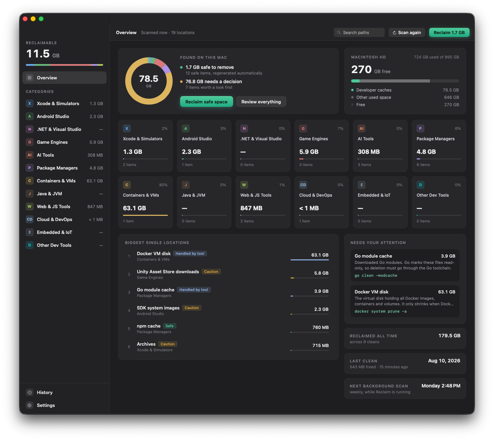

# Reclaim

[](https://github.com/allwiine/Reclaim/actions/workflows/ci.yml)
[](LICENSE)
[](#requirements)
[](https://reclaim-app.dev/)

## Install

Download the latest `Reclaim-<version>.dmg` from
[reclaim-app.dev](https://reclaim-app.dev/) or straight from
[Releases](https://github.com/allwiine/Reclaim/releases/latest), open it and
drag Reclaim to Applications. The app is notarized and updates itself via
Sparkle.

A native macOS app for finding and cleaning wasted developer storage, covering the space quietly retained by a wide range of developer tools: IDEs and editors, AI assistants, package managers, build systems, game engines, embedded toolchains, containers and cloud CLIs.

Reclaim scans a curated catalogue of known cache and scratch locations, shows what each one is, how risky it is to remove, and cleans your selection. Cleaning goes to the Trash by default, so mistakes are recoverable.

Optionally, add your development folders (from the welcome screen, the Projects section or Settings) and Reclaim finds git repos and regenerable artifacts inside them (node_modules, build outputs, virtualenvs, Pods), lists them by size and last activity so forgotten projects stand out, and cleans only the artifacts, never your code. Discovered projects rank alongside the regular catalogue on the overview.

Built with **Swift 6.2**, **SwiftUI**, the **Observation** framework, strict concurrency, and **Swift Testing**.



## What it covers

| Category | Examples |
| --- | --- |
| Xcode & Simulators | Derived data, device support files, archives, simulator caches, SwiftUI Previews data, device logs, XCTest simulator clones, unavailable simulators (`simctl`) |
| Android Studio | Gradle caches, wrapper distributions, build-scan data, IDE caches, Kotlin/Native toolchains, SDK system images, AVDs |
| .NET & Visual Studio | NuGet global packages & download caches, orphaned SDK workload packs, Azure Functions bundles, Visual Studio for Mac / Xamarin leftovers |
| Game Engines | Unity package & editor caches, Unity Asset Store downloads, Unreal derived data (incl. Zen), Godot caches & export templates |
| AI tools | Claude Code caches, logs & transcripts, Codex / Gemini / Copilot CLI data, Claude & ChatGPT Desktop caches, Cursor / Windsurf / Antigravity caches, Cline & Roo Code task history, Continue index, aider / Goose / OpenCode data, Ollama / Hugging Face / LM Studio / llama.cpp models, PyTorch caches |
| Package managers | Homebrew, npm, pnpm, Yarn (classic & Berry), pip, uv, Poetry, conda, pyenv, pipx, pub (Flutter/Dart), Composer, CocoaPods, SwiftPM, Cargo, Go, Deno, node-gyp, rustup & rbenv versions, mise cache |
| Containers & VMs | Docker VM disk, OrbStack / Colima / Lima / Podman machines (measured; cleaned via their own tools), Vagrant boxes, minikube cache, Rancher Desktop caches |
| Java & JVM | Maven local repository, SDKMAN archives, Coursier and Ivy/sbt caches |
| Web & JS tools | Playwright / Puppeteer browsers, Cypress binaries, Bun install cache, Electron caches, Corepack cache, nvm Node versions, Prisma engine binaries |
| Cloud & DevOps | kubectl, Helm and Pulumi caches, gcloud & Azure CLI logs, Terraform plugin cache, Firebase emulators |
| Embedded & IoT | PlatformIO cache, Arduino downloads, ESP-IDF toolchain archives |
| Other dev tools | VS Code caches & workspace storage, JetBrains caches & logs, Zed caches & language servers, ccache / sccache compiler caches, Bazel output trees, pre-commit environments |
| Your projects (optional) | node_modules, JS build outputs (.next, dist), Rust `target`, SwiftPM `.build`, Gradle builds, Python virtualenvs & caches, CocoaPods, Carthage builds, found inside the development folders you add and proven regenerable by their marker files (package.json, Cargo.toml, ...) |

Every item carries a safety rating:

- **Safe**: regenerated automatically (build caches, logs).
- **Caution**: restorable, but re-downloading or losing history costs something (downloaded models, session history, release archives).
- **Destructive**: removes things you created (emulators, installed language versions).

Items Reclaim should *not* delete itself (Docker's and OrbStack's VM disks, Colima / Lima / Podman machines, Go's read-only module cache, Bazel's output trees) are still measured, but cleaning is delegated to the owning tool with clear instructions. Claude Code's auth, settings and plugins are structurally excluded from the catalogue; a unit test enforces it.

## Requirements

- macOS 15 or later (macOS Tahoe 26 fully supported)
- Xcode 26 / Swift 6.2 toolchain to build

## Running

The project is a Swift package that Xcode opens directly:

```bash
git clone https://github.com/allwiine/Reclaim.git
cd Reclaim
open Package.swift        # then select the "Reclaim" scheme and Run
# or, without Xcode's UI:
swift run Reclaim
```

Run the tests with:

```bash
swift test
```

### Building a distributable .app

For day-to-day use, `swift run` is enough. To produce a proper `.app` bundle, an [XcodeGen](https://github.com/yonaskolb/XcodeGen) spec is included:

```bash
brew install xcodegen
xcodegen                  # generates Reclaim.xcodeproj
open Reclaim.xcodeproj    # archive / export as usual
```

The app is intentionally **not sandboxed**: its whole purpose is reading and cleaning locations across `~/Library` and dot-directories in your home folder. That rules out App Store distribution but keeps the UX honest: no folder-picker ceremony for every path.

### Permissions

Most locations are readable out of the box. If a scan row shows *Couldn't scan*, grant Reclaim (or your terminal, when using `swift run`) **Full Disk Access** in System Settings → Privacy & Security. Settings has a shortcut button.

## Safety model

1. **Scan is read-only.** Nothing is ever deleted during a scan.
2. **Cleaning operates on the scan-time snapshot only.** The scanner captures the exact deletion set (for cache roots, their children at scan time), and the engine disposes precisely those URLs; anything created after the scan is untouchable. What you saw is what gets cleaned.
3. **Trash by default.** Permanent deletion is opt-in via Settings.
4. **Explicit confirmation** with size and consequence before any cleanup, including a warning when a related app (Xcode, Android Studio, VS Code…) is currently running.
5. **Manual-only items are never touched**; the UI physically cannot select them.
6. **Post-clean rescan.** Numbers on screen are re-measured, never assumed; the summary counts only what was actually removed.
7. **Honest failures.** Unreadable locations show as "Couldn't scan" or "N unreadable" (with a Full Disk Access banner) instead of quietly measuring as empty; scans stopped early are labeled partial; a clean pass can be stopped between items.
8. **Your code is off limits.** Dev-folder scanning can only clean catalogued artifacts proven regenerable by a marker file; projects and repos themselves have no delete path, and `~/.claude` is refused as a development folder outright.

## Adding a new tool

One struct in [`TargetRegistry`](Sources/ReclaimKit/Domain/TargetRegistry.swift), with no other changes needed:

```swift
CleanupTarget(
    id: "deno-cache",
    name: "Deno cache",
    summary: "Remote modules cached by Deno. Re-downloaded on demand.",
    category: .packageManagers,
    safety: .safe,
    pathPatterns: ["~/Library/Caches/deno"],
    strategy: .removeContents
)
```

Patterns support `~` and `*` globs (`~/Library/Caches/Google/AndroidStudio*`); paths that don't exist on a machine are simply dropped. Registry conventions are enforced by `RegistryTests`, so `swift test` tells you immediately if a new entry breaks the rules.

## Project layout

```
Package.swift               Swift 6.2 package (app + libraries + tests)
project.yml                 Optional XcodeGen spec for a .app bundle
Sources/
  ReclaimKit/               UI-free core library (fully unit-tested)
    Domain/                 CleanupTarget, registry, artifact catalogue,
                            safety levels, status
    Services/               PathResolver, DiskSizer, TargetScanner,
                            BulkDirectoryReader, ProjectDiscovery,
                            CleanupEngine, FullDiskAccessProbe
    Support/                os.log categories
  ReclaimAppCore/           UI-free app state: AppModel, CleanSummary
  Reclaim/                  The SwiftUI app (views only)
Tests/ReclaimKitTests/      Core library suite
Tests/ReclaimAppCoreTests/  Orchestration suite (stubbed executors)
docs/ARCHITECTURE.md        Design and concurrency documentation
.github/workflows/ci.yml    Build & test on every push / PR
```

See [docs/ARCHITECTURE.md](docs/ARCHITECTURE.md) for the full design rationale.

## Contributing

Contributions are welcome, new cleanup targets especially (one struct plus
two localized strings). Start with [CONTRIBUTING.md](CONTRIBUTING.md), or
[propose a target](https://github.com/allwiine/Reclaim/issues/new?template=new_target.yml)
without writing any code. This project follows the
[Contributor Covenant](CODE_OF_CONDUCT.md).

## Security

Please report vulnerabilities privately; see [SECURITY.md](SECURITY.md).
Anything that could make Reclaim touch data outside the confirmed selection
counts, even if it isn't a classic vulnerability.

## License

MIT; see [LICENSE](LICENSE).
